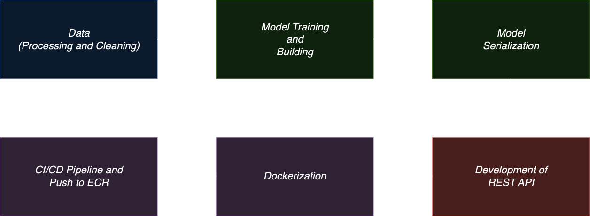

# ml-e2e


## Overview
This repository contains a complete end-to-end pipeline for building, deploying, and serving a machine learning model using Docker, Flask, AWS, and CI/CD with GitHub Actions. The pipeline includes data gathering, model building, API development, Dockerization, and deployment using AWS EC2.

The **Titanic Survival Prediction API** is a machine learning project that predicts whether a passenger survived the Titanic disaster based on various features such as age, sex, passenger class, and more. The project encompasses data preprocessing, model training, serialization, and deployment as a RESTful API using Flask. While the core functionalities are implemented, additional processes like model monitoring, load testing, and automated retraining are planned for future development.



## Features

- **Data Preprocessing:** Cleans and prepares the Titanic dataset for modeling.
- **Model Training:** Utilizes Logistic Regression for binary classification to predict survival.
- **Model Serialization:** Saves the trained model as a `model.pkl` file for deployment.
- **RESTful API:** Provides a `/predict` endpoint to serve predictions based on input features.
- **Dockerization:** Containerizes the Flask application for consistent deployment environments.
- **CI/CD Pipeline:** Automates testing and deployment processes using GitHub Actions.
- **Unit Testing:** Ensures the reliability of utility functions and API endpoints.

## Project Structure
- **app/**: Contains the application code including the Flask API (`app.py`) and utility functions (`utils.py`).
- **model.py**: Script for training and saving the machine learning model.
- **Dockerfile**: Defines the Docker image for the Flask application.
- **ci-cd.yml**: GitHub Actions workflow for CI/CD, automating linting, testing, Docker image building, and deployment.
- **tests/**: Contains unit tests for the utility functions (`test_utils.py`).

## Technologies Used

- **Programming Language:** Python 3.9
- **Frameworks & Libraries:**
  - Flask
  - Scikit-learn
  - Pandas
  - NumPy
  - Joblib
  - pytest
- **DevOps Tools:**
  - Docker
  - GitHub Actions
  - AWS Elastic Container Registry (ECR)
  - AWS EC2

## Installation
1. Clone this repository:
   ```bash
   git clone https://github.com/hardikkgupta/ml-e2e.git
   ```
2. Navigate to the project directory and create a virtual environment:
   ```bash
   cd ml-e2e
   python -m venv venv
   source venv/bin/activate
   ```
3. Install dependencies:
   ```bash
   pip install -r requirements.txt
   ```
4. Train the model and save it:
   ```bash
   python model.py
   ```

## Usage
1. Run the Flask API:
   ```bash
   python app/app.py
   ```
2. Make a Prediction Request:
You can use curl or any API client like Postman to send a POST request to the /predict endpoint.
    ```bash
    curl -X POST http://localhost:5000/predict \
     -H "Content-Type: application/json" \
     -d '{
           "features": {
               "Pclass": 3,
               "Age": 22.0,
               "SibSp": 1,
               "Parch": 0,
               "Fare": 7.25,
               "Sex_female": 0,
               "Sex_male": 1,
               "Embarked_Q": 0,
               "Embarked_S": 1,
               "FamilySize": 2
           }
         }'
    ```
3. Expected Response:
    ```bash
    {
    "prediction": 0
    }
    ```

## Docker Setup
1. Build the Docker image:
   ```bash
   docker build -t ml-e2e .
   ```
2. Run the Docker container:
   ```bash
   docker run -p 5000:5000 ml-e2e
   ```
3. Make Prediction Requests:
Use the same curl command as above, but replace localhost with your Docker host's IP if necessary.

## Testing
### Running Unit Tests
Ensure you have (`pytest`) installed. If not, install it:

```bash
pip install pytest
```
Run the test:
```bash
pytest tests/
```

### Test Coverage:

1. test_utils.py: Tests utility functions for model loading, input validation, prediction formatting, and error handling.
2. test_app.py: Tests Flask API endpoints for various scenarios, including successful predictions and handling of invalid inputs.

## Deployment
### Using GitHub Actions for CI/CD
The project is configured with GitHub Actions to automate the testing and deployment process.

1. Configure GitHub Secrets:
    Add the following secrets to your GitHub repository under **Settings > Secrets and variables > Actions > New repository secret**:

    (`AWS_ACCESS_KEY_ID`): Your AWS access key.

    (`AWS_SECRET_ACCESS_KEY`): Your AWS secret key.

    (`AWS_REGION`): AWS region (e.g., us-east-1).

    (`ECR_REGISTRY`): Your AWS ECR registry URL (e.g., 123456789012.dkr.ecr.us-east-1.amazonaws.com).

    (`EC2_SSH_KEY`): Your private SSH key for the EC2 instance.

    (`EC2_PUBLIC_IP`): The public IP address of your EC2 instance.
    Push Code to GitHub:

2. When you push code to the (`main`) branch, GitHub Actions will automatically:

    - Run linting and tests.
    - Build and push the Docker image to AWS ECR.
    - Deploy the Docker container to your AWS EC2 instance.
